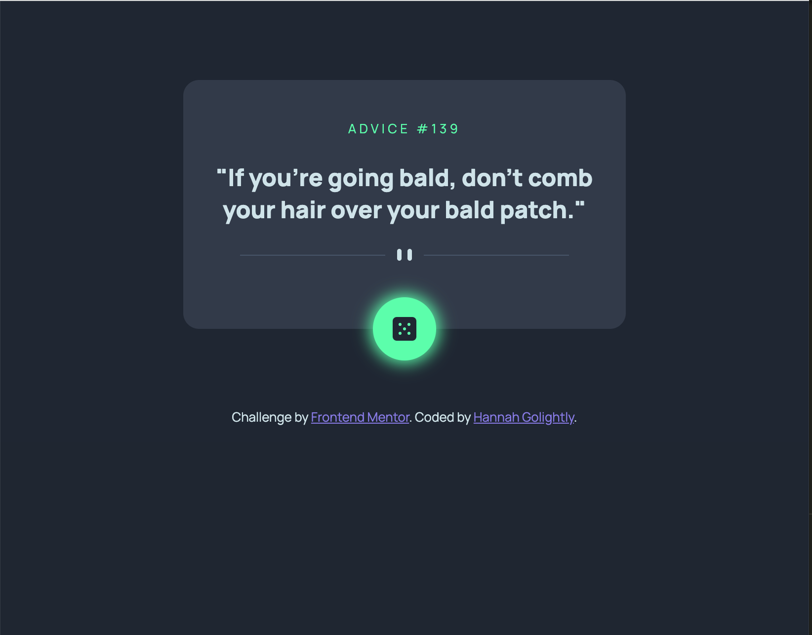

# Frontend Mentor - Advice generator app solution

This is a solution to the [Advice generator app challenge on Frontend Mentor](https://www.frontendmentor.io/challenges/advice-generator-app-QdUG-13db). Frontend Mentor challenges help you improve your coding skills by building realistic projects.

## Table of contents

- [Overview](#overview)
  - [The challenge](#the-challenge)
  - [Screenshot](#screenshot)
  - [Links](#links)
  - [Built with](#built-with)
  - [What I learned](#what-i-learned)
  - [Continued development](#continued-development)
- [Author](#author)

## Overview

### The challenge

Users should be able to:

- View the optimal layout for the app depending on their device's screen size
- See hover states for all interactive elements on the page
- Generate a new piece of advice by clicking the dice icon

### Screenshot

### Links

- Solution URL: [Add solution URL here](https://your-solution-url.com) NEED TO UPDATE 
- Live Site URL: [Add live site URL here](https://your-live-site-url.com)  NEED TO UPDATE 

### Built with

- Semantic HTML5 markup
- Vanilla JavaScript
- CSS custom properties
- Flexbox

### What I learned

This project was a good refresher in making API calls.

I'm proud of the fact that the design is generally responsive without the need for any media queries, due the use of css such as: 

.advice-area {
    position: relative;
    width: min(100% - 2rem, 28rem); /* chooses the smaller of the 2 */
    margin: 5rem auto;
    margin-inline: auto;
}

### Continued development

I'd like to experiment more with more complex API calls, and manipulation of the data received from the call, including POST, PUT requests etc.

## Author

- Website - [Add your name here](https://hannahgolightly.dev)
- Frontend Mentor - [@yourusername](https://www.frontendmentor.io/profile/yourusername)
